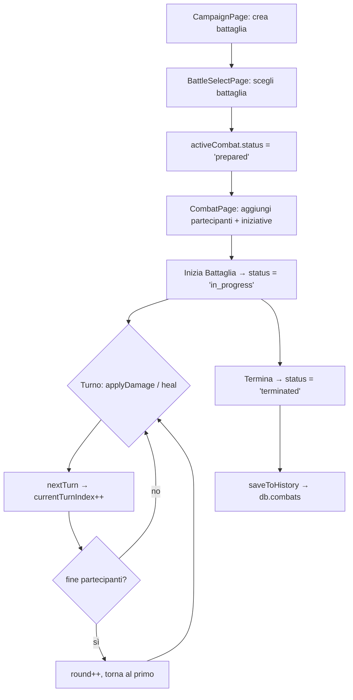

# ⚔️ Guida al Sistema di Combattimento (Battaglia)

Documentazione tecnica completa per comprendere, modificare ed estendere il sistema di battaglia.

---

## 1. Tipi di dato (`src/types/index.ts`)

Due entità principali:

### `CombatParticipant` — un singolo combattente

| Campo | Tipo | Significato |
|---|---|---|
| `id` | `string` | UUID univoco generato da `crypto.randomUUID()` |
| `type` | `'pc' \| 'npc' \| 'monster'` | Categoria del partecipante |
| `characterId` | `number?` | Collega il PG alla tabella `characters` nel DB |
| `hp / maxHp / currentHp` | `number` | HP massimi e attuali (i danni modificano solo `currentHp`) |
| `initiative` | `number` | Usata per ordinare la lista dei turni |
| `damage` | `string?` | Formula dado (es. `"2d6+3"`) per il tiro danno automatico |

### `Combat` (storico) e `ActiveCombat` (battaglia attiva)

```
ActiveCombat (sempre id='current' nel DB)
├── combatId        → FK verso la tabella combats (storico)
├── campaignId      → FK verso campaigns
├── status          → 'prepared' | 'in_progress' | 'terminated'
├── participants[]  → lista CombatParticipant
├── currentTurnIndex  → indice del partecipante di turno
└── round
```

---

## 2. Database — Dexie (`src/db/database.ts`)

IndexedDB con 7 tabelle. Quelle rilevanti per il combattimento:

| Tabella | Chiave | Scopo |
|---|---|---|
| `activeCombat` | `id = 'current'` | **Singleton** — la battaglia in corso (una sola alla volta) |
| `combats` | `++id` | Storico battaglie salvate |
| `characters` | `++id, campaignId` | PG delle campagne (HP sincronizzati in tempo reale) |

> **Regola chiave:** esiste sempre al massimo **un solo** `activeCombat` con `id='current'`.
> Tutte le operazioni leggono quello, lo modificano e lo riscrivono.

Per aggiungere nuovi campi alle tabelle, aggiungere un blocco `this.version(N).stores({...}).upgrade(...)` in `database.ts`.

---

## 3. Hook `useCombat` (`src/hooks/useCombat.ts`) — il cuore della logica

Usa `useLiveQuery` di Dexie per reagire automaticamente ai cambiamenti del DB.  
Ogni funzione segue questo schema:

```
Flusso tipico di una modifica:
DB → useLiveQuery → React re-render
        ↑
  put(nextState) ← calcola nextState ← get('current')
```

1. Legge lo stato corrente da `db.activeCombat.get('current')`
2. Calcola il nuovo stato
3. Scrive con `db.activeCombat.put(nextState)`
4. Se la battaglia è collegata a una campagna, sincronizza anche `db.combats` via `persistLinkedCombat()`

### Funzioni principali

| Funzione | Cosa fa |
|---|---|
| `applyDamage(id, amount)` | Riduce `currentHp`, clampato a 0. Se è un PG sincronizza anche `characters` |
| `heal(id, amount)` | Aumenta `currentHp`, clampato a `maxHp` |
| `nextTurn()` | Incrementa `currentTurnIndex % participants.length`; se torna a 0 incrementa `round` |
| `addParticipant(p)` | Normalizza, rinomina i mostri duplicati (es. "Goblin 2"), ri-ordina per iniziativa mantenendo il turno corrente |
| `removeParticipant(id)` | Filtra e aggiusta l'indice per non saltare turni |
| `sortByInitiative()` | Ri-ordina mantenendo il partecipante di turno attivo nella stessa posizione |
| `saveToHistory()` | Salva/aggiorna in `db.combats` |
| `loadFromHistory(id)` | Carica una battaglia dallo storico in `activeCombat` |
| `createCombatForCampaign(id)` | Crea un record in `combats` e lo collega a una campagna |
| `setCombatStatus(id, status)` | Cambia `prepared → in_progress → terminated` |
| `newCombat()` | Azzera participants e round, mantiene `combatId` e `campaignId` |

---

## 4. Helper (`src/hooks/utils.ts`)

| Funzione | Cosa fa |
|---|---|
| `normalizeParticipant()` | Assicura che tutti i campi HP siano numeri validi, genera UUID se mancante |
| `sortParticipantsByInitiative()` | Ordine decrescente; pareggio risolto per nome (locale `it`) |
| `getNextMonsterName()` | Auto-numera copie dello stesso mostro: "Goblin" → "Goblin 2" → "Goblin 3" |
| `normalizeCombatStatus()` | Mappa il vecchio valore `'completed'` → `'terminated'` per retrocompatibilità |
| `normalizeCombatRecord()` | Normalizza un record Combat letto dal DB (partecipanti, status, campi mancanti) |

---

## 5. Struttura dei componenti (`src/components/combat/`)

```
CombatPage
├── CombatHeader        ← breadcrumb, round/turno, bottoni Inizia/Prossimo/Termina/Salva
├── CombatTracker       ← pannello principale: aggiunta partecipanti + lista
│   ├── SearchSelect    ← dropdown PG/Mostri/NPC dalla libreria
│   ├── [modal iniziativa]  ← chiede il valore prima di aggiungere il partecipante
│   └── ParticipantList ← card per ogni partecipante
│       └── ParticipantActions  ← bottoni danno rapido (-1/-5/-10),
│                                  cura (+1/+5/+10),
│                                  tiro dado (formula `damage`),
│                                  input personalizzato
└── InitiativePanel     ← widget fluttuante e trascinabile (fixed position)
                          mostra ordine turni, HP bar, round counter
                          collassabile ad icona cliccabile
```

---

## 6. Ciclo di vita di una battaglia



---

## 7. Sincronizzazione HP dei PG

Quando si applica danno/cura a un partecipante di tipo `pc`, la funzione `syncCharacterHpFromParticipant` aggiorna anche il record in `characters`:

1. Prima cerca per `characterId` (match diretto)
2. Poi cerca per nome nella stessa campagna (`campaignId`)
3. Infine cerca globalmente per nome

Questo mantiene gli HP del personaggio aggiornati anche fuori dal combattimento.

---

## 8. Come aggiungere/modificare funzionalità

### Aggiungere un campo a un partecipante
1. Aggiungilo al tipo `CombatParticipant` in `src/types/index.ts`
2. Gestiscilo in `normalizeParticipant()` in `src/hooks/utils.ts`
3. Aggiungilo al form in `CombatTracker.tsx`

### Aggiungere una nuova azione in combattimento
1. Scrivi la funzione in `useCombat.ts`
2. Esponila nel `return` dell'hook
3. Passala via `useDB` → `CombatPage` → componente figlio come prop

### Aggiungere un nuovo stato alla battaglia
1. Aggiorna l'union type di `status` in `src/types/index.ts`
2. Aggiorna `normalizeCombatStatus()` in `src/hooks/utils.ts`
3. Aggiorna la logica nei componenti (`CombatHeader`, `CombatPage`, ecc.)

### Aggiungere una nuova versione del database
1. Aggiungi un blocco in `database.ts`:
```ts
this.version(N).stores({ /* schema */ }).upgrade(async (trans) => {
  // migrazione dati esistenti
});
```
